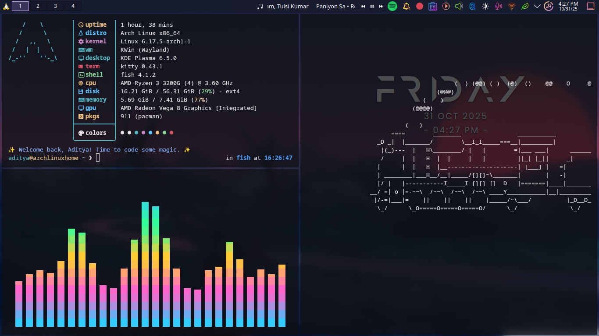

# CAVA Configuration — README



Simple, sleek, and terminal-friendly CAVA (Console-based Audio Visualizer) configuration for a transparent Kitty/Alacritty/terminal setup on KDE/Wayland or X11.

---

## What this repo contains

* `config` — main CAVA config file you can drop into `~/.config/cava/config`.
* `README.md` — this file (you are reading it).
* `preview.png` — **(optional)** screenshot used for the preview in this README. Add your own screenshot here.

---

## Preview

If you place a screenshot at `./preview.png`, it will show up above. To take a screenshot:

* On Wayland (KDE): use **Spectacle** or `grim`/`slurp` workflows.
* On X11: use `scrot` or `maim`.

Example (X11):

```bash
# focus the terminal running cava and capture a selection or window
scrot -u preview.png
# or
maim -s preview.png
```

Example (Wayland with grim):

```bash
grim -g "$(slurp)" preview.png
```

Drop `preview.png` in this repo root and push to GitHub to show the preview.

---

## Features

* Smooth bars and adaptive decay tuned for music and system audio.
* Tunable sensitivity and smoothing so it looks good with both quiet and loud sources.
* Transparent-friendly output so it layers well over a blurred terminal background.
* Basic comments in the config to explain each option.

---

## Requirements

* `cava` (v0.6+ recommended)
* ALSA or PulseAudio or pipewire (the config reads whatever your system provides)
* A terminal that supports truecolor and transparency (Kitty, alacritty, or konsole with transparency)

---

## Installation

1. Create the config directory (if not present):

```bash
mkdir -p ~/.config/cava
```

2. Copy the `config` file into place:

```bash
cp config ~/.config/cava/config
```

3. Run cava with the config (default reads `~/.config/cava/config` automatically):

```bash
# explicit path
cava -p ~/.config/cava/config

# or just
cava
```

If you use PipeWire/PulseAudio and cava fails to find input, you may need to configure a capture source. See Troubleshooting below.

---

## Key options explained (quick)

* `sensitivity` — how responsive the bars are to quiet sounds. Increase for more activity during quiet audio.
* `framerate` — smoothness of the visualizer (lower uses less CPU).
* `bars` / `bands` — number and look of vertical bars.
* `method` — FFT size and windowing method (affects accuracy vs performance).
* `colors` — the color palette used for the bars.
* `background` / `foreground` — used for terminals that support alternate palette; not all terminals obey these.

(Full comments live inside the `config` file.)

---

## Tips for a nice look

* Use a blurred terminal background (KWin blur or a compositor) so CAVA feels like it's floating.
* Match the terminal font and line height so bars align nicely with your terminal grid.
* If you want pixel-perfect transparency on Wayland, run your terminal as a native Wayland client (Kitty/Alacritty support this).

---

## Troubleshooting

* **No audio input / "no device found"**: make sure your audio stack (PulseAudio/pipewire/ALSA) is running and that cava is allowed to capture a monitor or source. On Pulse/pipewire you may need to create a loopback sink or use `parec` as input.

* **Bars too noisy / too quiet**: tweak `sensitivity` and `gain` to taste.

* **Bad performance**: lower `framerate` and reduce `bars`/`bands`.

---

## Customization examples

* Increase smoothing for slow-moving visuals.
* Add more bands for a denser visual.
* Use `gradient` or custom `colors` arrays for a neon look.

(See commented examples inside `config`.)

---

## Credits

Built from community-tested settings with tweaks for transparency and KDE look.

---

## License

MIT — feel free to use and adapt. Drop a star if you like it.

---

## Contributing

Send a PR with your tweaks, a short note explaining what you changed, and a preview image placed as `preview.png` in the PR branch.
